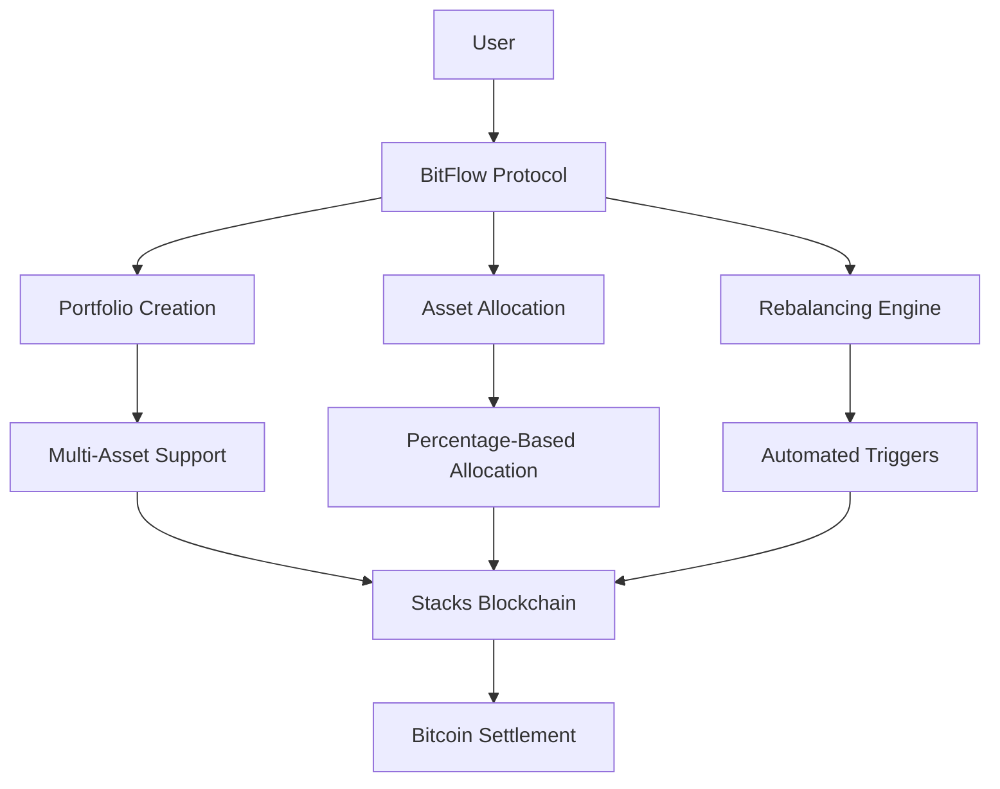
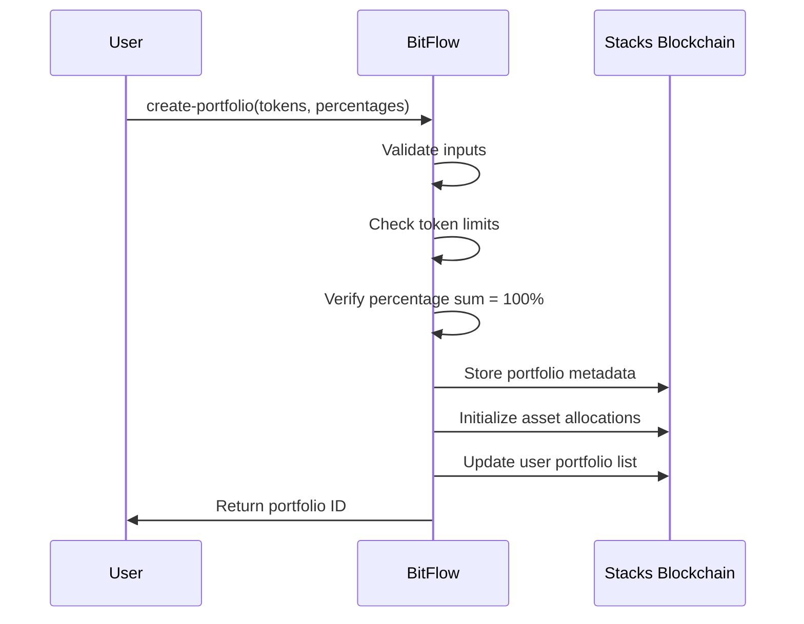
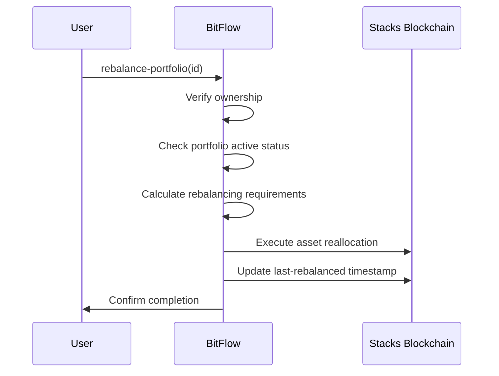

# BitFlow Portfolio Engine

[](https://stacks.co)
[](https://bitcoin.org)
[](https://clarity-lang.org)

> **Intelligent Asset Allocation Protocol for Bitcoin Layer 2**

BitFlow revolutionizes digital asset management on the Stacks blockchain by providing institutional-grade portfolio automation. Built for the Bitcoin ecosystem, it enables seamless diversification across BTC-native assets while maintaining Bitcoin's base layer security guarantees.

## 🚀 Key Features

**🎯 Automated Portfolio Management**

- Algorithmic rebalancing with customizable triggers
- Support for up to 10 assets per portfolio
- Precise allocation control with basis point accuracy

**⚡ Gas-Optimized Operations**

- Batch operations for cost-effective management
- Efficient storage patterns and execution paths
- Minimal transaction overhead

**🔒 Security & Decentralization**

- No custody requirements - users maintain full control
- Built-in risk controls and validation mechanisms
- Fully decentralized with transparent operations

**🏗️ Bitcoin-Native Architecture**

- Leverages Stacks Layer 2 for Bitcoin settlement finality
- Compatible with Bitcoin DeFi ecosystem
- Designed for institutional and retail users

## 📊 System Overview

BitFlow operates as a comprehensive portfolio management protocol that abstracts the complexity of multi-asset allocation and rebalancing into simple, user-friendly operations.



### Core Components

1. **Portfolio Registry**: Central storage for portfolio metadata and ownership
2. **Asset Allocation Engine**: Manages individual token allocations within portfolios  
3. **Rebalancing Mechanism**: Automated and manual rebalancing capabilities
4. **User Management**: Tracks portfolio ownership and access controls

## 🏗️ Contract Architecture

### Data Structures

```clarity
;; Primary portfolio metadata
Portfolios: portfolio-id -> {
  owner: principal,
  created-at: uint,
  last-rebalanced: uint, 
  total-value: uint,
  active: bool,
  token-count: uint
}

;; Individual asset allocations
PortfolioAssets: {portfolio-id, token-id} -> {
  target-percentage: uint,
  current-amount: uint,
  token-address: principal
}

;; User portfolio ownership
UserPortfolios: principal -> (list 20 uint)
```

### Function Categories

**📖 Read-Only Functions**

- `get-portfolio(id)` - Retrieve portfolio information
- `get-portfolio-asset(portfolio-id, token-id)` - Get asset details
- `get-user-portfolios(user)` - List user's portfolios
- `calculate-rebalance-amounts(id)` - Rebalancing analysis
- `get-protocol-info()` - Protocol statistics

**✍️ Public Functions**

- `create-portfolio(tokens, percentages)` - Create new portfolio
- `rebalance-portfolio(id)` - Execute rebalancing
- `update-portfolio-allocation(id, token-id, percentage)` - Modify allocations
- `deactivate-portfolio(id)` - Disable portfolio

**🔐 Administrative Functions**

- `transfer-ownership(new-owner)` - Protocol governance
- `set-protocol-fee(fee)` - Fee management

## 🔄 Data Flow

### Portfolio Creation Flow



### Rebalancing Flow



## 🛠️ Usage Examples

### Creating a Portfolio

```clarity
;; Create a balanced portfolio with 3 assets
(contract-call? .bitflow-portfolio create-portfolio
  (list 'SP1H1733V5MZ3SZ9XRW9FKYGEZT0JDGEB8Y634C7R.arkadiko-token
        'SP2C2YFP12AJZB4MABJBAJ55XECVS7E4PMMZ89YZR.wrapped-bitcoin  
        'SP1Z92MPDQEWZXW36VX71Q25HKF5K2EPCJ304F275.stackswaps-token-v4k)
  (list u4000 u4000 u2000)) ;; 40% + 40% + 20% = 100%
```

### Rebalancing a Portfolio

```clarity
;; Rebalance portfolio ID 1
(contract-call? .bitflow-portfolio rebalance-portfolio u1)
```

### Updating Allocations

```clarity
;; Change first token allocation to 50%
(contract-call? .bitflow-portfolio update-portfolio-allocation
  u1    ;; portfolio-id
  u0    ;; token-id (first token)
  u5000) ;; 50% in basis points
```

## 📋 Protocol Specifications

### Limits & Constraints

| Parameter | Value | Description |
|-----------|-------|-------------|
| Max Tokens per Portfolio | 10 | Maximum assets in single portfolio |
| Max Portfolios per User | 20 | User portfolio ownership limit |
| Protocol Fee | 0.25% | Default fee (25 basis points) |
| Max Protocol Fee | 5% | Maximum allowable protocol fee |
| Basis Points Scale | 10,000 | 100% = 10,000 basis points |

### Error Codes

| Code | Constant | Description |
|------|----------|-------------|
| 100 | ERR-NOT-AUTHORIZED | Unauthorized access attempt |
| 101 | ERR-INVALID-PORTFOLIO | Portfolio doesn't exist or invalid |
| 102 | ERR-INSUFFICIENT-BALANCE | Insufficient funds for operation |
| 103 | ERR-INVALID-TOKEN | Invalid token address provided |
| 104 | ERR-REBALANCE-FAILED | Portfolio rebalancing failed |
| 105 | ERR-PORTFOLIO-EXISTS | Portfolio already exists |
| 106 | ERR-INVALID-PERCENTAGE | Invalid allocation percentage |
| 107 | ERR-MAX-TOKENS-EXCEEDED | Too many tokens in portfolio |
| 108 | ERR-LENGTH-MISMATCH | Input array length mismatch |
| 109 | ERR-USER-STORAGE-FAILED | User storage update failed |
| 110 | ERR-INVALID-TOKEN-ID | Invalid token ID reference |

## 🚀 Deployment

### Prerequisites

- Stacks blockchain access (Mainnet/Testnet)
- Clarity CLI tools
- Sufficient STX for deployment gas fees

### Deployment Steps

1. **Compile Contract**

   ```bash
   clarity-cli check bitflow-portfolio.clar
   ```

2. **Deploy to Network**

   ```bash
   stx deploy_contract bitflow-portfolio bitflow-portfolio.clar \
     --testnet --private-key your-private-key
   ```

3. **Verify Deployment**

   ```bash
   stx call_read_only_function bitflow-portfolio get-protocol-info \
     --testnet
   ```

## 🔒 Security Considerations

### Built-in Protections

- **Ownership Validation**: All portfolio operations require owner authorization
- **Input Validation**: Comprehensive checks on all user inputs
- **Percentage Validation**: Ensures allocations sum to exactly 100%
- **Bounds Checking**: Prevents array overflow and invalid indices
- **State Consistency**: Atomic operations maintain data integrity

### Best Practices

- Always validate portfolio ownership before operations
- Check portfolio active status before rebalancing
- Verify token addresses before creating portfolios
- Monitor gas costs for large portfolios
- Implement frontend validation for better UX

## 📈 Roadmap

### Phase 1: Core Protocol ✅

- [x] Portfolio creation and management
- [x] Basic rebalancing functionality  
- [x] User ownership tracking
- [x] Administrative controls

### Phase 2: Advanced Features 🚧

- [ ] Dynamic rebalancing triggers
- [ ] Portfolio templates and strategies
- [ ] Integration with price oracles
- [ ] Fee collection mechanisms

### Phase 3: Ecosystem Integration 🔮

- [ ] DEX integration for automated trading
- [ ] Yield farming strategy support
- [ ] Cross-chain asset support
- [ ] Mobile and web application

## 🤝 Contributing

We welcome contributions to BitFlow Portfolio Engine! Please see our [Contributing Guidelines](CONTRIBUTING.md) for details on:

- Code standards and formatting
- Testing requirements  
- Pull request process
- Issue reporting

## 📜 License

This project is licensed under the MIT License - see the [LICENSE](LICENSE) file for details.

## 🔗 Links

- [Stacks Documentation](https://docs.stacks.co)
- [Clarity Language Reference](https://docs.stacks.co/clarity)
